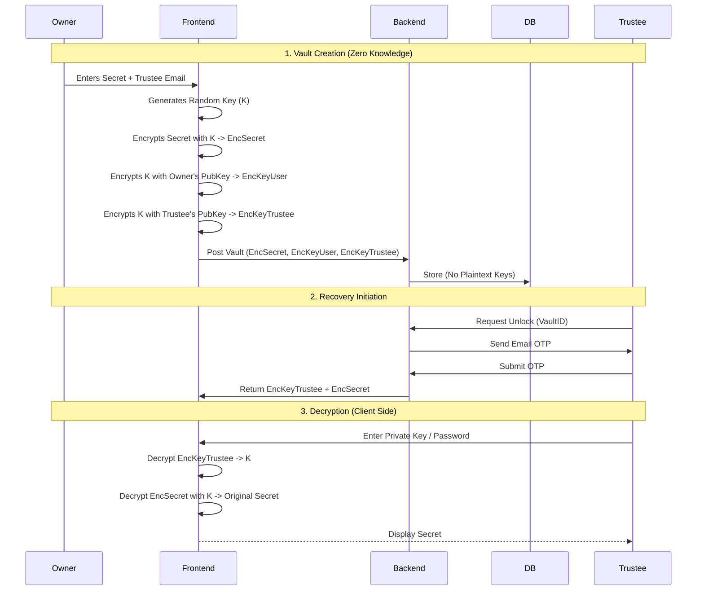

# Genwealth


[](https://opensource.org/licenses/MIT)

Genwealth is a secure, decentralized digital legacy management platform built on the **Base** blockchain. It allows users to encrypt their digital assets and sensitive information, ensuring that they can be securely recovered by designated trustees or heirs through a Zero-Knowledge (ZK) proof-based recovery process.

## 🚀 Deployed on Base

This project is proudly deployed on the Base Mainnet, leveraging its low fees and Ethereum compatibility to provide a seamless and secure user experience for digital inheritance.

## 🏗 System Architecture

The core of Genwealth is its Zero-Knowledge Architecture, which ensures that the platform *never* has access to the user's unencrypted secrets or recovery passwords.

### Zero-Knowledge Trustee Recovery Flow



## ✨ Features

- **Zero-Knowledge Privacy**: User data is encrypted client-side; the server only stores encrypted blobs.
- **Trustee Designation**: Securely assign heirs or trusted individuals to recover specific vaults.
- **Dead Man's Switch**: Automated inactivity checks (coming soon) to trigger recovery protocols.
- **IPFS Integration**: Decentralized storage for large files and documents.

## 🛠 Tech Stack

- **Blockchain**: Base (Coinbase L2)
- **Backend**: Node.js, Express, Sequelize, PostgreSQL
- **Frontend**: React, TweetNaCl (Encryption)
- **Storage**: IPFS

## 📦 Getting Started

### Prerequisites

- Node.js v18+
- PostgreSQL
- Base Wallet (Coinbase Wallet, Metamask, etc.)

### Installation

1. Clone the repository
   ```bash
   git clone https://github.com/yourusername/genwealth.git
   ```

2. Install dependencies
   ```bash
   cd genwealth/backend
   npm install
   ```

3. Run migrations
   ```bash
   npx sequelize-cli db:migrate
   ```

4. Start the server
   ```bash
   npm run dev
   ```